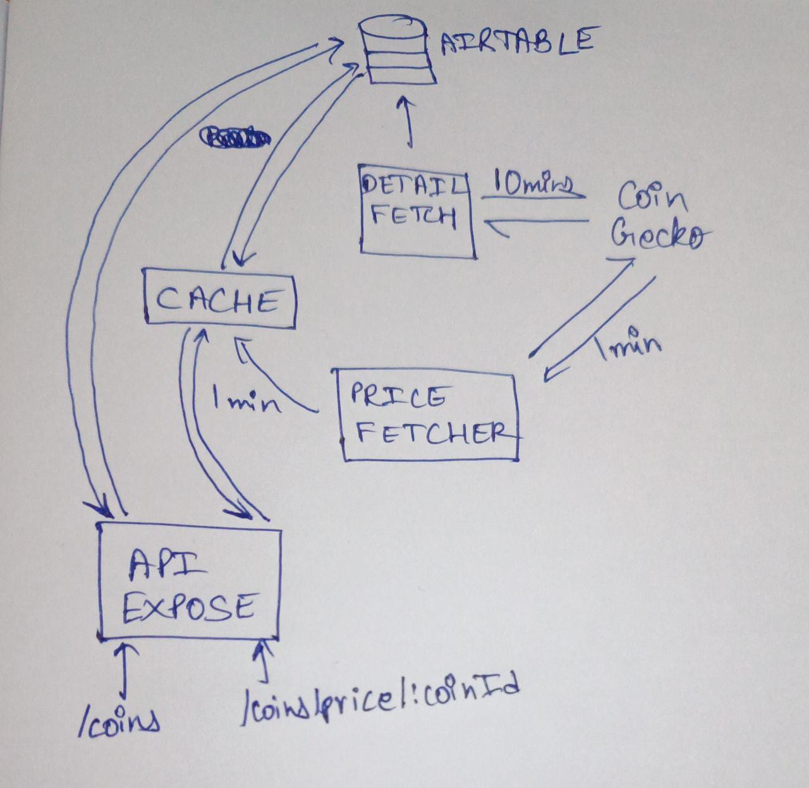

# Cryptocurrency Backend
**Goal:**  \
Design and implement an application that provides information about cryptocurrency. Create a functional backend system that retrieves and updates cryptocurrency data. \
The Question Doc can be seen at location: `Cryptocurrency Backend Assignment.pdf`

-----
### Architecture Diagram



### Assumptions:
1. The decision of which is the Top Coin is dependent on the Market Cap value. 
2. Given how the question is written, its not possible to have a cache miss. Whenever we get the top 20 coins and their relevant data, we store it both in the cache and the database. 


### File Structure
1. `api.py`: Return JSON responses in Flask. 
2. `cache.py`: Stores data relevant to the Top20 coins in the cache. 
3. `updater.py`: File when executed calls the coin data and uploads it into the AirTable and at the same time, stores it into the cache. 
4. `env-vars`: Stores the API Key, so that it is not revealed in the main code files **(security purposes)**.


### Execution
```
python api.py
python cache.py
source env-vars
python updater.py
```
To get coin related data, you can do:
```
curl 127.0.0.01:5000/coins/
curl 127.0.0.01:5000/coins/price/
```

-----